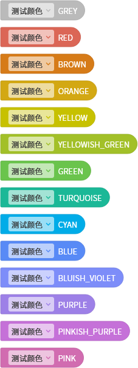

# 颜色

## Color

枚举类型。

### CoCo

v2.6 版本新增。

- `COCO_EVENT`：CoCo 事件积木的颜色。
- `COCO_CONTROL`：CoCo 控制积木的颜色。
- `COCO_FUNCTION0`：CoCo 功能积木的颜色。
- `COCO_OPERATION`：CoCo 运算积木的颜色。
- `COCO_VARIABLE`：CoCo 变量积木的颜色。
- `COCO_LIST`：CoCo 列表积木的颜色。
- `COCO_DICTIONARY`：CoCo 字典积木的颜色。
- `COCO_FUNCTION1`：CoCo 函数积木的颜色。

### Creation Project

v2.6 版本新增。

- `CREATION_PROJECT_EVENT`：Creation Project 事件积木的颜色。
- `CREATION_PROJECT_CONTROL`：Creation Project 控制积木的颜色。
- `CREATION_PROJECT_CALCULATION`：Creation Project 计算积木的颜色。
- `CREATION_PROJECT_FUNCTION0`：Creation Project 功能积木的颜色。
- `CREATION_PROJECT_OBJECT`：Creation Project 对象积木的颜色。
- `CREATION_PROJECT_LIST`：Creation Project 列表积木的颜色。
- `CREATION_PROJECT_VARIABLE`：Creation Project 变量积木的颜色。
- `CREATION_PROJECT_FUNCTION1`：Creation Project 函数积木的颜色。

### 常用

这些颜色是经过测试后发现在亮度、饱和度、对比度、区分度上都非常适合用来给积木的配色。

- `GREY`：灰色。
- `RED`：红色。
- `BROWN`：棕色。
- `YELLOW`：黄色。
- `GREEN`：绿色。
- `CYAN`：青色。
- `BLUE`：蓝色。
- `PURPLE`：紫色。
- `PINKISH_PURPLE`：粉红色。
- `PINK`：粉色。

v2.6 版本新增：

- `ORANGE`：橘黄色。
- `YELLOWISH_GREEN`：黄绿色。
- `TURQUOISE`：青绿色。
- `BLUISH_VIOLET`：蓝紫色。

预览：

